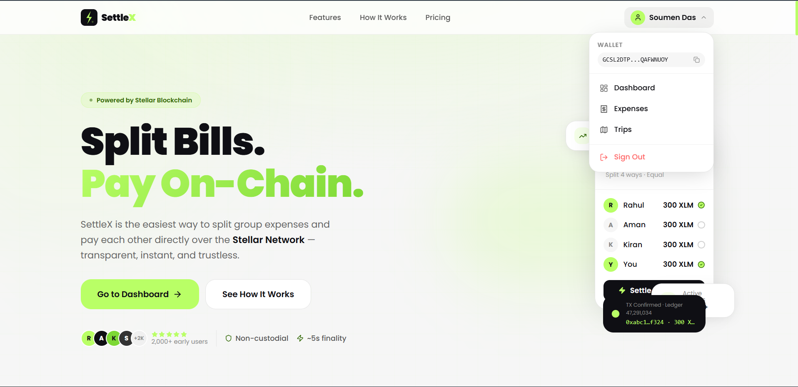
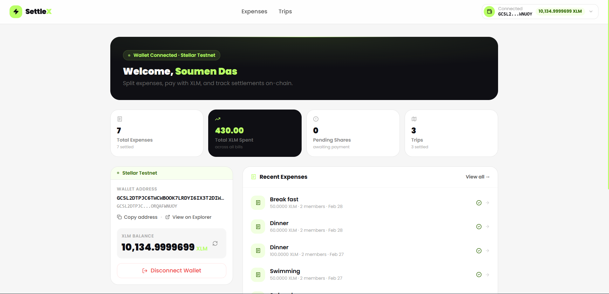
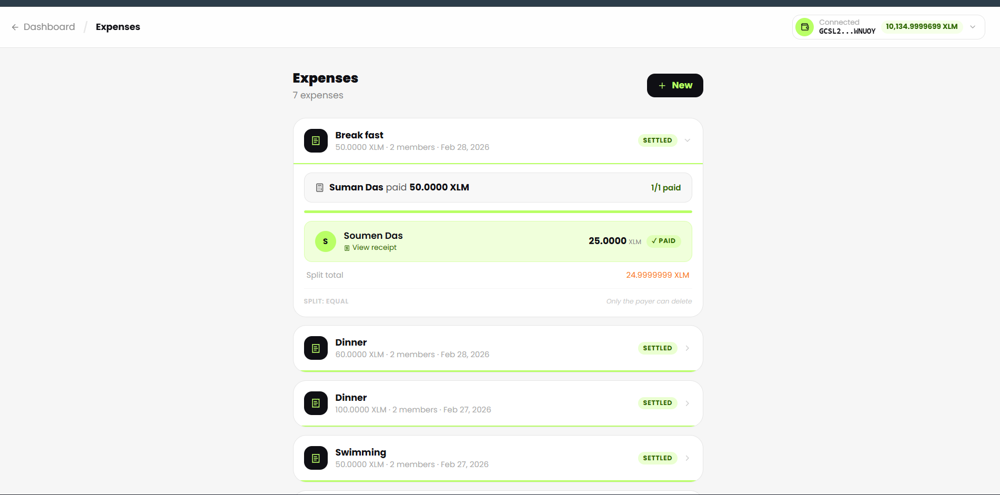
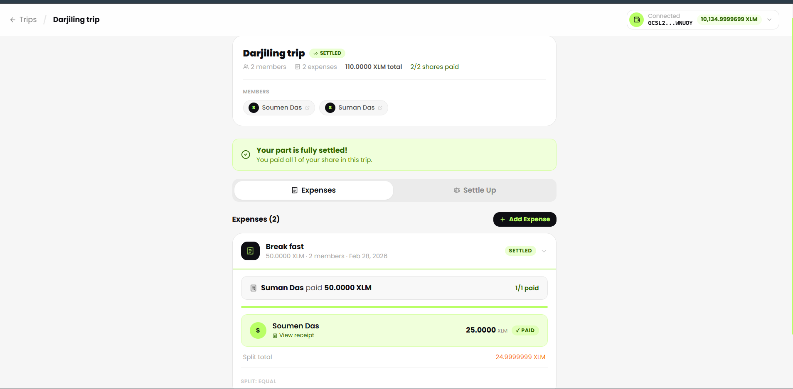
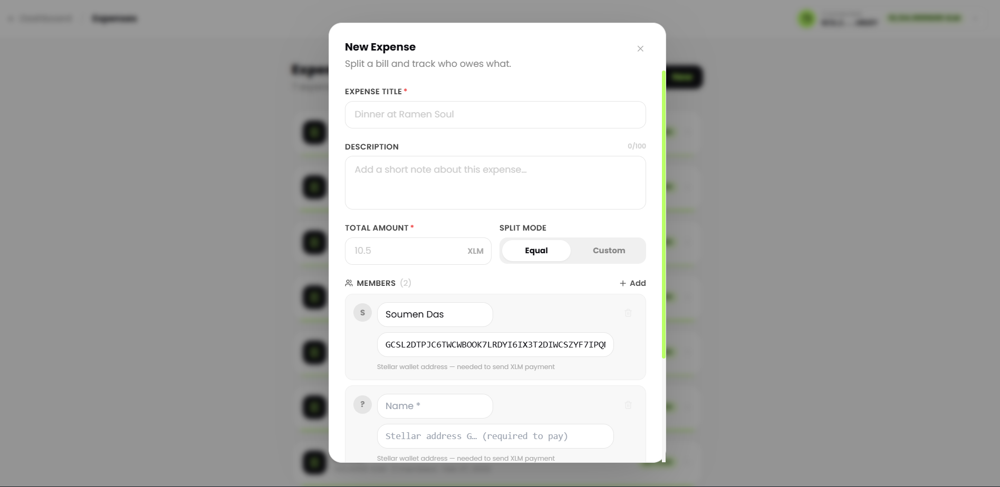
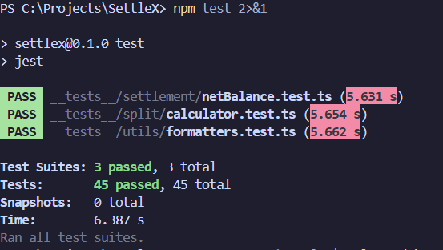

<p align="center">
  
</p>

<h1 align="center">SettleX — Split Bills. Pay On-Chain.</h1>

<p align="center">
  A decentralised expense-splitting application built on the <strong>Stellar Network</strong>.<br/>
  Add group expenses, split them by any method, and settle every share directly from your wallet — confirmed on-chain in under 5 seconds.
</p>

<p align="center">
  <a href="https://stellar.expert/explorer/testnet/contract/CDYWC4JQBCARETZ5VKDJNNY3H37WX3CRUG764NBI7JGU37MYQCKMRU74">
    
  </a>
  <a href="https://stellar.expert/explorer/testnet/tx/588b55a12910227e3d7aa849f70efebde6ab2f0ca75e95389a67e33f9dd930ff">
    
  </a>
  
  
</p>

<p align="center">
  <a href="https://settle-x-pi.vercel.app/"><strong>Live Demo</strong></a> &nbsp;&bull;&nbsp;
  <a href="https://youtu.be/gnUaUONmb3I"><strong>Demo Video</strong></a>
</p>

---

## Table of Contents

- [Project Description](#project-description)
- [Features](#features)
- [Tech Stack](#tech-stack)
- [Screenshots](#screenshots)
- [How It Works](#how-it-works)
- [Smart Contract](#smart-contract)
- [Setup Instructions](#setup-instructions)
- [Environment Variables](#environment-variables)
- [Testing](#testing)
- [Project Structure](#project-structure)
- [Testnet Notes](#testnet-notes)

---

## Project Description

SettleX solves a fundamental problem with group expense sharing: apps like Splitwise only track IOUs — you still have to chase people for real money. SettleX closes the loop by connecting split calculations directly to on-chain payments.

Every payment produces a **real, verifiable transaction hash** on the Stellar blockchain. An on-chain Soroban smart contract acts as an immutable settlement ledger, so payment records cannot be edited or disputed. The app syncs across all participants in real time — when someone pays, everyone sees it immediately.

**Core design principles:**

- **Non-custodial** — your private key never leaves your wallet extension. SettleX only receives the signed transaction envelope.
- **No intermediary** — money moves peer-to-peer between Stellar wallets; the app never holds funds.
- **On-chain receipts** — every settled share has a Stellar transaction hash you can verify on [stellar.expert](https://stellar.expert/explorer/testnet).
- **Multi-wallet** — supports Freighter, xBull, and Lobstr via a custom `StellarWalletsKit` with install detection.

---

## Features

| Feature                                                      | Status |
| ------------------------------------------------------------ | ------ |
| Multi-wallet connect (Freighter, xBull, Lobstr)              | Live   |
| Create and split expenses — equal, percentage, custom weight | Live   |
| Pay shares with XLM (Stellar Payment operation)              | Live   |
| SEP-0007 QR code generation for mobile wallets               | Live   |
| Transaction hash receipt linked to Stellar Explorer          | Live   |
| Soroban contract: immutable on-chain payment recording       | Live   |
| Real-time event listening from contract (`pmt_rec` events)   | Live   |
| Trip mode — group expenses with net-balance settle-up        | Live   |
| Live cross-user sync via Supabase Realtime                   | Live   |
| Net-balance algorithm (minimises transactions needed)        | Live   |
| Mobile-responsive UI                                         | Live   |

---

## Tech Stack

| Layer            | Technology                                     |
| ---------------- | ---------------------------------------------- |
| Framework        | Next.js 14 (App Router, TypeScript)            |
| Styling          | Tailwind CSS 3.4, Framer Motion                |
| Blockchain SDK   | `@stellar/stellar-sdk` v14                     |
| Wallet support   | `@stellar/freighter-api` v6, xBull SDK, Lobstr |
| Smart contract   | Soroban (Rust, `soroban-sdk` v21)              |
| Network          | Stellar Testnet (Horizon + Soroban RPC)        |
| Database         | Supabase (PostgreSQL + Realtime)               |
| QR codes         | `qrcode.react`, `qrcode`                       |
| Testing          | Jest 29 + ts-jest (45 unit tests)              |
| State management | React Context + Supabase + localStorage        |
| UI primitives    | Radix UI, Lucide React                         |

---

## Screenshots

### Home / Landing Page



---

### Dashboard — Wallet Connected & Balance Displayed

The dashboard shows your connected public key, live XLM balance fetched from Horizon, and the Testnet indicator.



---

### Expenses — Wallet Options & Split View

The multi-wallet selector lets users connect via Freighter, xBull, or Lobstr. Wallets not installed show an "Install" badge. Below it the expenses list shows split breakdowns with Pay XLM buttons per share.



---

### Trips Overview



---

### New Expense Form

Define members, set amounts, and choose the split mode (equal / percentage / custom weight). The form calculates each share in real time.



---

### Test Output — 45 Tests Passing

All three test suites passing with Jest + ts-jest.



---

## How It Works

```
User connects wallet (Freighter / xBull / Lobstr)
              |
User creates expense, adds members, picks split mode
              |
App calculates each member's exact share
              |
Payer clicks "Pay XLM"
              |
    +---------+-----------+
    |                     |
buildTransaction()    checkIsPaid()     <- on-chain duplicate check (Soroban)
    |
TransactionBuilder constructs Payment operation
  · from:   payer public key
  · to:     payee Stellar address
  · amount: share amount in XLM
  · memo:   expense ID
    |
Wallet extension signs client-side
(private key never leaves the browser)
    |
Signed envelope submitted to Horizon REST API
    |
Stellar validators confirm in ~5 seconds
    |
recordPaymentOnChain() stores to Soroban contract:
  trip_id, expense_id, payer, member, amount, tx_hash
    |
tx hash stored in app, share marked "paid"
useContractEvents polls every 10s -> syncs state for all participants
```

---

## Smart Contract

SettleX deploys a **Soroban smart contract** on Stellar Testnet as an immutable, tamper-proof ledger of all settled payments.

### Deployed Contract

| Field       | Value                                                                                                                                  |
| ----------- | -------------------------------------------------------------------------------------------------------------------------------------- |
| Contract ID | `CDYWC4JQBCARETZ5VKDJNNY3H37WX3CRUG764NBI7JGU37MYQCKMRU74`                                                                             |
| Network     | Stellar Testnet                                                                                                                        |
| Language    | Rust (`soroban-sdk` v21.7.6)                                                                                                           |
| Explorer    | [stellar.expert → contract](https://stellar.expert/explorer/testnet/contract/CDYWC4JQBCARETZ5VKDJNNY3H37WX3CRUG764NBI7JGU37MYQCKMRU74) |

### Verified Contract Call Transaction

**Transaction hash:** `588b55a12910227e3d7aa849f70efebde6ab2f0ca75e95389a67e33f9dd930ff`

[View on Stellar Explorer](https://stellar.expert/explorer/testnet/tx/588b55a12910227e3d7aa849f70efebde6ab2f0ca75e95389a67e33f9dd930ff)

This transaction is a live, verifiable `record_payment` call to the deployed contract on Stellar Testnet.

### Contract Functions

| Function                                                              | Type  | Purpose                                                 |
| --------------------------------------------------------------------- | ----- | ------------------------------------------------------- |
| `record_payment(trip_id, expense_id, payer, member, amount, tx_hash)` | Write | Stores payment record on-chain after XLM transfer       |
| `get_payments(trip_id)`                                               | Read  | Returns all payment records for a trip                  |
| `is_paid(expense_id, member)`                                         | Read  | Checks if a member has already settled a specific share |

**Error codes handled by the frontend:**

| Code | Name            | Meaning                                  |
| ---- | --------------- | ---------------------------------------- |
| #1   | `InvalidAmount` | Payment amount is zero or negative       |
| #2   | `AlreadyPaid`   | This share was already settled on-chain  |
| #3   | `EmptyId`       | Trip ID or expense ID is an empty string |

### Why a Smart Contract?

In a Horizon-only setup there is no shared source of truth for payment status — any user could mark a share as paid without actually transferring XLM. The Soroban contract solves this:

- `record_payment` stores the real Stellar `tx_hash` as proof of transfer.
- `is_paid` acts as a duplicate guard — re-settling an already-paid share is rejected on-chain with `AlreadyPaid (#2)`.
- All records are permanently on the Stellar ledger and cannot be modified or deleted by anyone, including the app operator.

### Real-Time Events

The contract emits a `pmt_rec` event for every confirmed payment. `hooks/useContractEvents.ts` polls the Soroban RPC every 10 seconds and on browser tab focus. New events are deduplicated by `txHash` and merged into React state — all participants see confirmed payments without refreshing the page.

---

## Setup Instructions

### Prerequisites

- **Node.js** v18 or later
- **npm** v9 or later
- **Freighter Wallet** browser extension — [freighter.app](https://freighter.app)
  - In Freighter: Settings → Network → select **Testnet**
- A funded Stellar Testnet account — get free XLM from [Stellar Friendbot](https://horizon-testnet.stellar.org/friendbot?addr=YOUR_PUBLIC_KEY)

### 1. Clone the repository

```bash
git clone https://github.com/soumen0818/SettleX.git
cd SettleX
```

### 2. Install dependencies

```bash
npm install
```

### 3. Create a Supabase project

SettleX uses Supabase for real-time cross-user sync. Without it, data only persists locally in the current browser session.

1. Create a free project at [supabase.com](https://supabase.com).
2. In the SQL Editor, run the full schema from [`supabase-setup.sql`](supabase-setup.sql) (or follow [docs/SUPABASE_SETUP.md](docs/SUPABASE_SETUP.md) for a walkthrough).
3. Copy your **Project URL** and **anon key** from Project Settings → API.

### 4. Configure environment variables

```bash
cp .env.local.example .env.local
```

Fill in your Supabase credentials. The contract ID and RPC URL are pre-filled with the deployed testnet values. See [Environment Variables](#environment-variables) for the full reference.

### 5. Start the development server

```bash
npm run dev
```

Open [http://localhost:3000](http://localhost:3000) and connect your Freighter wallet (set to Testnet).

### 6. Build for production

```bash
npm run build
npm run start
```

---

## Environment Variables

Create (or edit) `.env.local` in the project root:

```env
# Stellar Network
NEXT_PUBLIC_STELLAR_NETWORK=TESTNET
NEXT_PUBLIC_HORIZON_URL=https://horizon-testnet.stellar.org
NEXT_PUBLIC_STELLAR_EXPLORER=https://stellar.expert/explorer/testnet

# Soroban Smart Contract (deployed — no changes needed)
NEXT_PUBLIC_SOROBAN_RPC_URL=https://soroban-testnet.stellar.org
NEXT_PUBLIC_CONTRACT_ID=CDYWC4JQBCARETZ5VKDJNNY3H37WX3CRUG764NBI7JGU37MYQCKMRU74

# Supabase (from Project Settings → API in your Supabase dashboard)
NEXT_PUBLIC_SUPABASE_URL=https://your-project.supabase.co
NEXT_PUBLIC_SUPABASE_ANON_KEY=your-anon-key-here

# App
NEXT_PUBLIC_APP_NAME=SettleX
NEXT_PUBLIC_APP_VERSION=1.0.0
```

> All variables carry the `NEXT_PUBLIC_` prefix because they are read client-side. The Supabase anon key is safe to expose — access is governed by Row Level Security (RLS) policies in your database.

---

## Testing

### JavaScript / TypeScript unit tests

```bash
npm test
```

For coverage report:

```bash
npm run test:coverage
```

| Test file                                 | Coverage                                                                                     |
| ----------------------------------------- | -------------------------------------------------------------------------------------------- |
| `__tests__/split/calculator.test.ts`      | Equal split, custom/weighted split, amount validation, Stellar address format checks         |
| `__tests__/settlement/netBalance.test.ts` | Net-balance algorithm: simple debt, netting, three-person chains, wallet address passthrough |
| `__tests__/utils/formatters.test.ts`      | `formatAddress`, `formatXLM`, `stroopsToXlm` conversions                                     |

**45 tests across 3 suites — all passing.** See the test output screenshot in [Screenshots](#screenshots).

### Rust contract tests

```bash
cd contract
cargo test
```

8 tests: `record_and_query`, `multiple_members`, `multiple_expenses_same_trip`, `duplicate_payment_rejected`, `zero_amount_rejected`, `negative_amount_rejected`, `is_paid_unknown_returns_false`, `get_payments_unknown_trip_is_empty`.

---

## Project Structure

```
settlex/
├── app/
│   ├── page.tsx                  # Landing page
│   ├── auth/page.tsx             # Authentication
│   ├── dashboard/page.tsx        # Dashboard (wallet + balance)
│   ├── expenses/page.tsx         # Expense list and management
│   └── trips/
│       ├── page.tsx              # Trip list
│       └── [id]/page.tsx         # Trip detail — expenses + settle-up tab
│
├── components/
│   ├── landing/                  # Hero, Features, HowItWorks, Pricing, Testimonials
│   ├── expenses/                 # ExpenseForm, SplitCalculator, PaymentRow, ReceiptModal
│   ├── payment/                  # PayButton, PaymentStatus, QRCodeDisplay, TransactionHash
│   ├── trips/                    # TripCard, TripForm, ExpenseList, SettlementSummary
│   ├── wallet/                   # ConnectWalletButton, WalletInfo, WalletGuard
│   └── ui/                       # Button, Modal, Badge, Spinner, Toast, Logo
│
├── context/
│   ├── ExpenseContext.tsx        # Global expense state
│   ├── TripContext.tsx           # Global trip state
│   ├── AuthContext.tsx           # Authentication state
│   └── WalletContext.tsx         # Wallet connection state
│
├── hooks/
│   ├── useWallet.ts              # Multi-wallet connection (StellarWalletsKit)
│   ├── useExpense.ts             # Expense CRUD
│   ├── useTrip.ts                # Trip CRUD
│   ├── usePayment.ts             # Full 7-state payment flow orchestration
│   └── useContractEvents.ts      # Real-time Soroban event polling
│
├── lib/
│   ├── stellar/
│   │   ├── walletsKit.ts         # Custom multi-wallet provider (Freighter, xBull, Lobstr)
│   │   ├── contract.ts           # Soroban contract calls + error decoding
│   │   ├── events.ts             # pmt_rec event fetch and decode
│   │   ├── buildTransaction.ts   # Stellar Payment transaction builder
│   │   ├── submitTransaction.ts  # Horizon broadcast
│   │   └── getBalance.ts         # Account balance query
│   ├── qr/generator.ts           # SEP-0007 URI + QR generation
│   └── settlement/netBalance.ts  # Net-balance optimisation algorithm
│
├── contract/
│   └── src/lib.rs                # Soroban smart contract source (Rust)
│
├── __tests__/
│   ├── split/calculator.test.ts
│   ├── settlement/netBalance.test.ts
│   └── utils/formatters.test.ts
│
└── docs/
    ├── QUICKSTART.md
    ├── SUPABASE_SETUP.md
    ├── AUTHENTICATION_SETUP.md
    └── MANUAL_TESTING_GUIDE.md
```

---

## Testnet Notes

- This app runs entirely on **Stellar Testnet** — no real funds are used.
- Fund your Freighter testnet wallet with the Friendbot:
  ```
  https://horizon-testnet.stellar.org/friendbot?addr=YOUR_PUBLIC_KEY
  ```
- All transactions and contract events are visible at [stellar.expert/explorer/testnet](https://stellar.expert/explorer/testnet).
- The deployed contract address and sample transaction on this page can be verified live on the explorer at any time.

---

## License

MIT © 2026 SettleX
